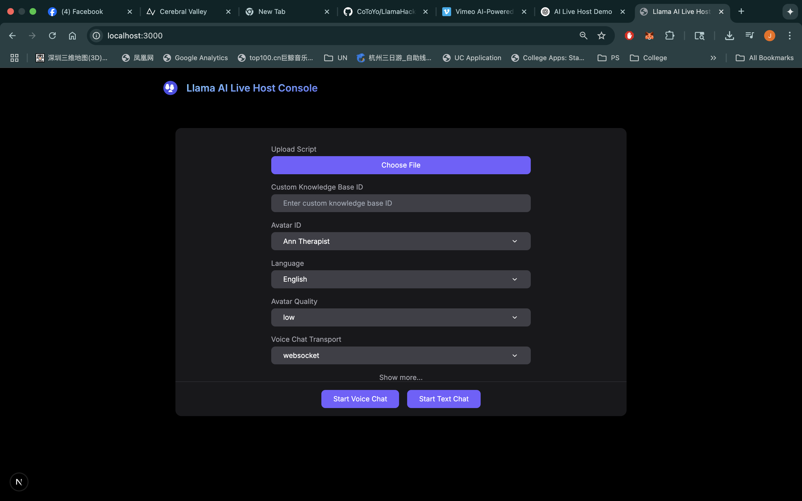
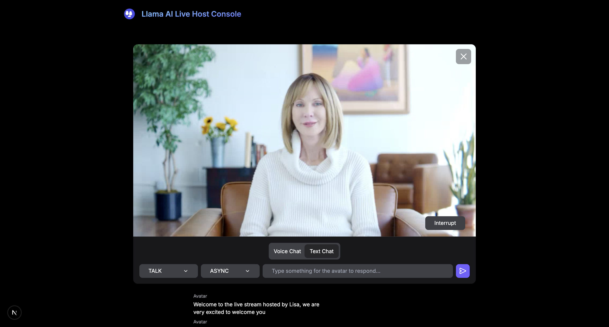
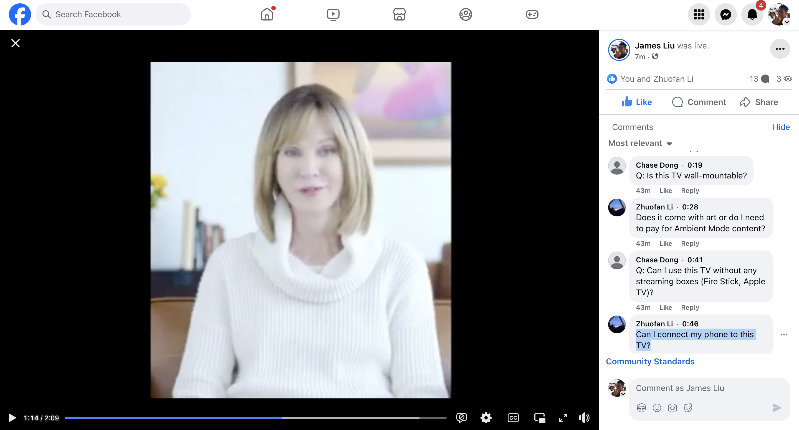

# 🛍️ AI Live Host Demo – LLAMA Hackathon 2025

This demo spins up **Lisa**, your AI-powered live shopping host, designed to empower sellers of all sizes to run engaging, real-time shopping streams — with zero on-camera presence needed.

## 🔥 Background

https://www.cnbc.com/2025/06/19/ai-humans-in-china-just-proved-they-are-better-influencers.html Just last week, A Chinese entrepreneur raked in $7.65 million after streaming using an interactive digital avatar.

Live shopping has become a powerful commerce channel. Platforms like **TikTok Shop** have proven this by generating **$1.5M GMV in a single live session**. However, many small or emerging sellers struggle to host livestreams due to lack of time, expertise, or budget to hire a live host.

## 💡 Our Solution

At **LLAMA Hackathon 2025**, we introduce **Lisa**, the AI Live Shopping Host. Lisa is a virtual livestream presenter that:

- Runs a livestream on the seller’s behalf
- Generates dynamic, engaging product intros using seller-provided data
- Interacts with viewers in real time
- Responds to comments and questions automatically
- Maximizes conversion — without seller intervention

This is a step toward democratizing live commerce for all.

## 🎥 Demo Flow

1. **Upload Product Data via Seller Portal**
   - Seller provides product specs, user reviews, FAQs, etc.
   - We use this data to ground Lisa’s knowledge base.

   


2. **Generate Script with LLaMA**
   - A scripted live show is dynamically created using Meta's LLaMA API.

3. **Launch AI Livestream via OBS to Facebook Live**
   - The AI avatar (powered by HeyGen + LiveKit) goes live.
   - Streaming is handled via OBS integration.

      

4. **Real-time Comment Handling**
   - Viewer comments are asynchronously ingested and classified.
   - Relevant questions are sent to LLaMA for contextual answers.
   - Lisa responds live, alternating between script and Q&A.

       

5. **Smart Orchestration**
   - A custom orchestrator decides when to continue the script vs. when to answer viewer comments for maximum engagement and sales impact.

## 🧩 Tech Stack

- **AI Avatar Rendering:** HeyGen Streaming API
- **Live Streaming Infrastructure:** LiveKit + OBS
- **LLM Backend:** Meta LLaMA API
- **Frontend Portal:** React + Node.js (optional)
- **Comment Ingestion:** Async processing with WebSocket/Queue
- **Script & Response Generation:** Prompt templating + LLaMA output parsing
- **Orchestration Engine:** Custom-built decision layer

## 🚀 Getting Started

### Prerequisites

- OBS Studio
- Node.js / Python (for orchestration and backend scripts)
- Access to:
  - HeyGen Streaming API
  - Meta LLaMA API
  - LiveKit Room setup
  - Facebook Live RTMP credentials

### Local Setup

```bash
# Clone the repo
git clone https://github.com/CoToYo/LlamaHackathon2025.git

# Install dependencies
npm install

# Set up environment
cp .env.example .env
# Add your API keys and configuration to .env

# Run the app
npm run dev
